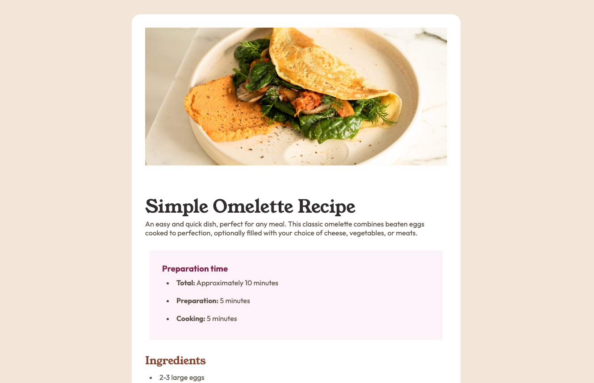
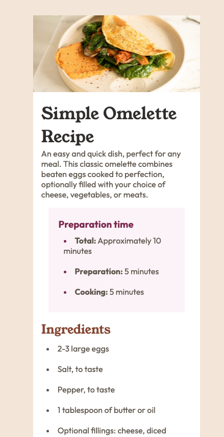

## Table of contents

- [Overview](#overview)
  - [Screenshot](#screenshot)
  - [Links](#links)
- [My process](#my-process)
  - [Built with](#built-with)
  - [What I learned](#what-i-learned)
  - [Continued development](#continued-development)
- [Author](#author)
- [Acknowledgments](#acknowledgments)

## Overview

### Screenshot

### Links

- Solution URL: [AR_recipe-page-main](https://github.com/andrewxrojas/AR_recipe-page-main)
- Live Site URL: [Live site](https://andrewxrojas.github.io/AR_recipe-page-main/)

## My process

### Built with

- Semantic HTML5 markup
- CSS custom properties

### What I learned

This challenge has taught me how to li:marker to make specific changes to the bullet points. Also, I learned how to use media queries more effectively. I created the mobile view first. Once I stylized the recipe layout, I used media queries to resize the layout and design to reflect the desktop view.

### Continued development

I want to continue learning about CSS styles, media query, and responsive layouts as I feel that these are important skills to learn in order to make a user friendly designs.

## Author

- Website - [Andrew Joel](https://www.andrewxrojas.com)
- Frontend Mentor - [@andrewxrojas](https://www.frontendmentor.io/profile/andrewxrojas)

## Acknowledgments

I would like to express my gratitude to Frontend Mentor for providing these challenges. They are extremely helpful, and I truly value these opportunities.